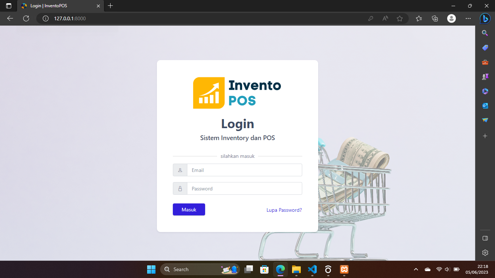
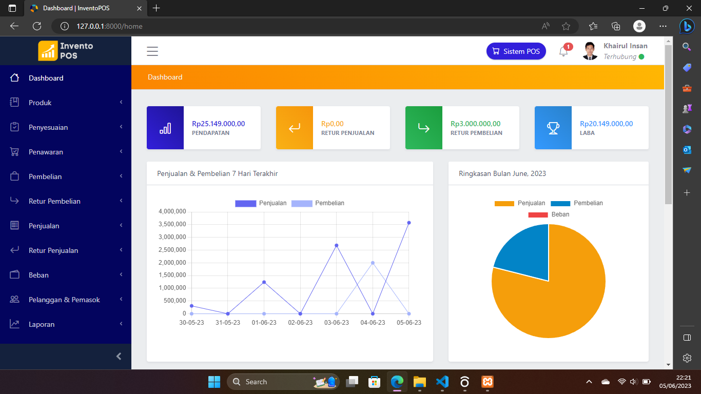
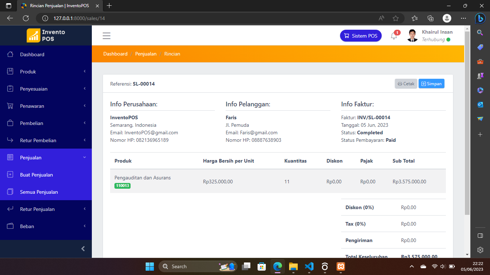

# InventoPOS


> This Project is ready for Production. If you find any bug or have any suggestion please create an Issue.

# Local Installation

- run
  ```
  git clone https://github.com/khairulInsan20/InventoPOS.git
  ```

- run
  ```
  composer install
  ``` 

- run
  ```
  npm install
  ```

- run
  ```
  npm run dev
  ```

- copy .env.example to .env

- run
  ```
  php artisan key:generate
  ```

- set up your database in the .env

- run
  ```
  php artisan migrate --seed
  ```

- run
  ```
  php artisan storage:link
  ```

- run
  ```
  php artisan serve
  ```

- kemudian kunjungi
  ```
  http://localhost:8000 or http://127.0.0.1:8000
  ```


# Admin Credentials

> Email: admin@test.com || Password: 12345678

## Demo







## Fitur InventoPOS

- **Manajemen Produk & Cetak Barcode**

- **Manajemen Stok**

- **Buat Penawaran & Kirim Melalui Email**

- **Manajemen Pembelian**

- **Manajemen Penjualan**

- **Manajemen Retur Penjualan & Pembelian**

- **Manajemen Beban**

- **Manajemen Pemasok & Pelanggan**

- **Manajemen Pengguna (Peran & Izin)**


- **Pengaturan Mata Uang**

- **Pengaturan Sistem**

- **Laporan**

# License

**[Creative Commons Attribution 4.0	cc-by-4.0](https://creativecommons.org/licenses/by/4.0/)**
> Only for learning purposes, if there are parties who feel aggrieved please contact khairulinsan248@gmail.com.
